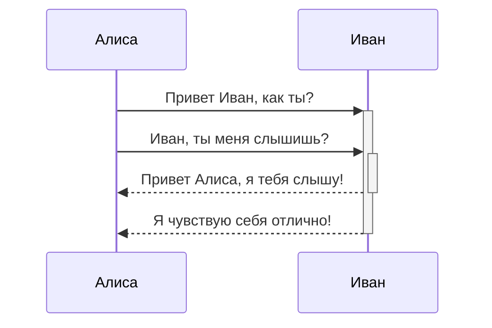
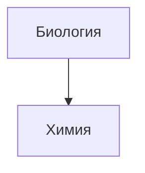

Obsidian использует библиотеку [Mermaid](https://mermaid-js.github.io/) для отображения диаграмм и схем. У Mermaid есть удобный [«живой редактор»](https://mermaid-js.github.io/mermaid-live-editor).

````

````


Obsidian поддерживает ссылки на заметки внутри элементов Mermaid:
````

````


Второй, но более простой способ:

````

````


Таким образом, все имена заметок (по крайней мере до `Z[имя заметки]`) автоматически присваиваются к классу `internal-link` при использовании этого фрагмента.

Если вы используете специальные символы в названиях заметок, то вам нужно заключать их в двойные кавычки:  
`"⨳ специальный символ"`

Во [втором способе](https://publish.obsidian.md/help-ru/%D0%A0%D1%83%D0%BA%D0%BE%D0%B2%D0%BE%D0%B4%D1%81%D1%82%D0%B2%D0%B0/%D0%A4%D0%BE%D1%80%D0%BC%D0%B0%D1%82%D0%B8%D1%80%D0%BE%D0%B2%D0%B0%D0%BD%D0%B8%D0%B5+%D0%B7%D0%B0%D0%BC%D0%B5%D1%82%D0%BE%D0%BA#^376b9d) это делается следующим образом:  
`A["⨳ специальный символ"]`
